# Worskop: Algorithm and Flowshart

## 2 Calculate Total and Avarage Marks

### Psedocode

```text
START
    numberOfSubjects = 3
    total = 0
    FOR i IN numberOfSubjects
        INPUT marks
        total = total + marks
    ENDFOR
    avarage = total / numberOfSubjects
    PRINT "Total: " + total
    PRINT "Avarage: " + avarage
END
```

### Flowchart

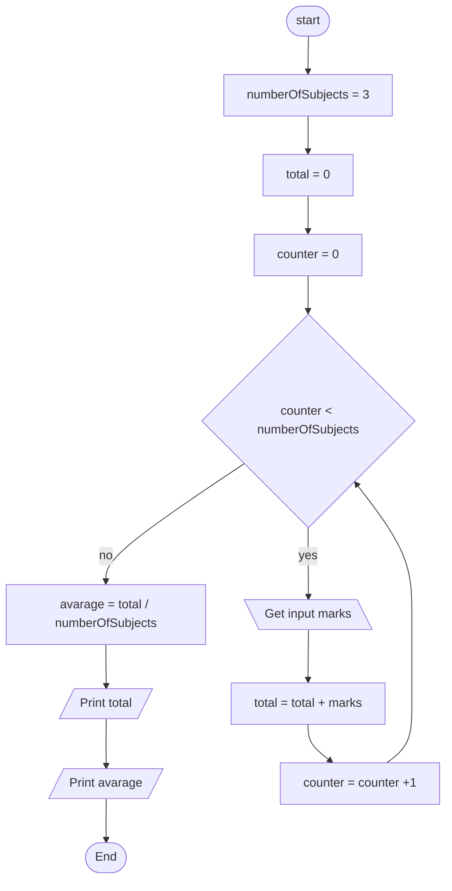

## 3 Display Multiplication Table

### Pseudocode

```text
START
    INPUT number
    FOR i in RANGE(1, 10)
        result = i * number
        PRINT number * i = result
    ENDFOR
END
```

Here I am making the assumption that RANGE(1, 10) gives each of the numbers 1 to 10, inclusive. 
The PRINT message is a bit simplified compared to what would be required to convert to a string in a programming language. 


### Flowchart

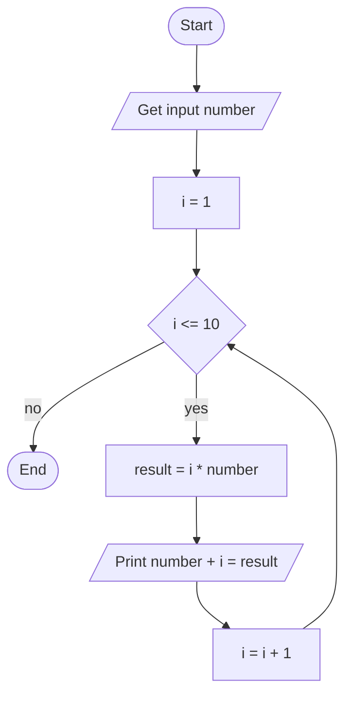

## 4 Positive, Negative, or Zero Check

### Pseudocode

```text
START
    INPUT number
    IF number > 0 THEN
        PRINT Positive
    ELSE IF number < 0 THEN
        PRINT Negative
    ELSE
        PRINT Zero
    ENDIF
END
```

### Flowchart

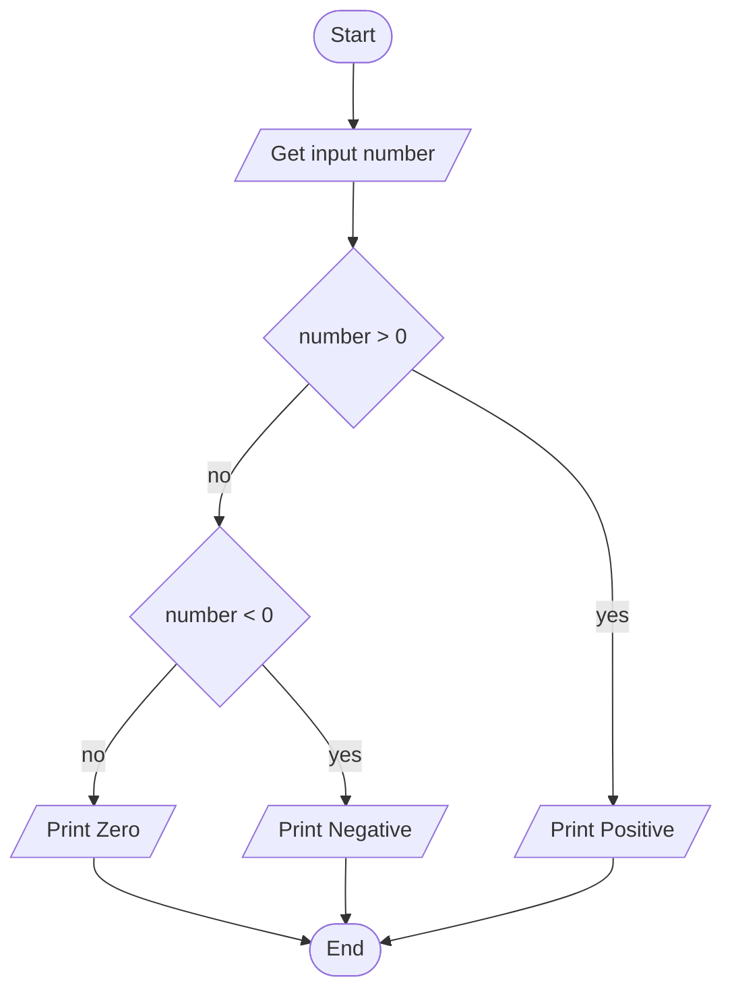

## 5 Simple Interest Calculator

### Pseudocode

There are differences in the wording of this exercise that makes me think this code is called from a program rather than run directly by a user. If this is not the case change OUTPUT to print and perhaps add additional prints to politely ask for each of the input values, and better explain the output. 

```text
START
    INPUT P // Principal
    INPUT R //Rate of interest
    INPUT T //Time
    SI = (P * R * T) / 100
    OUTPUT SI
END
```


### Flowchart

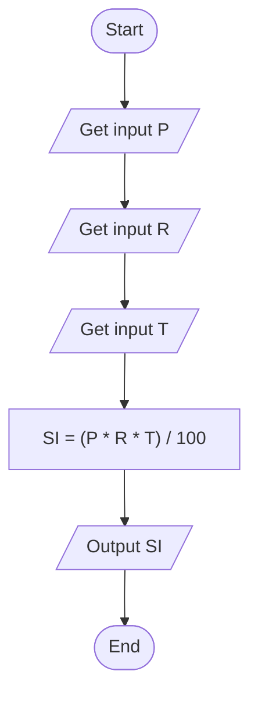

## 6 Avarage Temperature Calculation

### Pseudocode

very similar to assignment 2

```text
START
    numberOfDays = 7
    total = 0
    FOR i IN numberOfDays
        INPUT temperature
        total = total + temperature
    ENDFOR
    avarage = total/numberOfDays
    PRINT avarage
END
```

### Flowchart

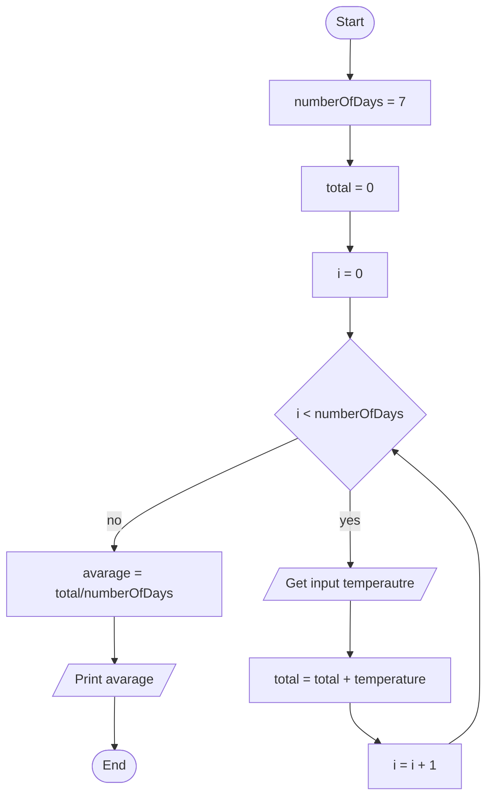

## 7

### Pseudocode

```text
START
    Print "Input length"
    INPUT length
    Print "Input width"
    INPUT width
    area = length * width
    PRINT "The area of the rectangle is " + area
END
```

### Flowchart

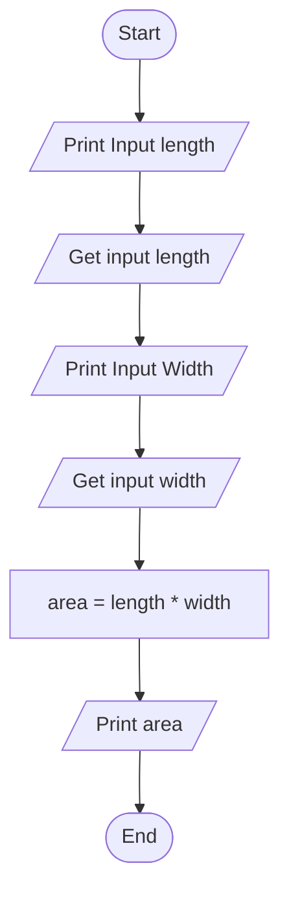

## 8 Determine Pass or Fail

### Pseudocode

```text
START
    INPUT marks
    IF marks >= 50 THEN
        PRINT Pass
    ELSE
        PRINT Fail
    ENDIF
END
```

### Flowchart

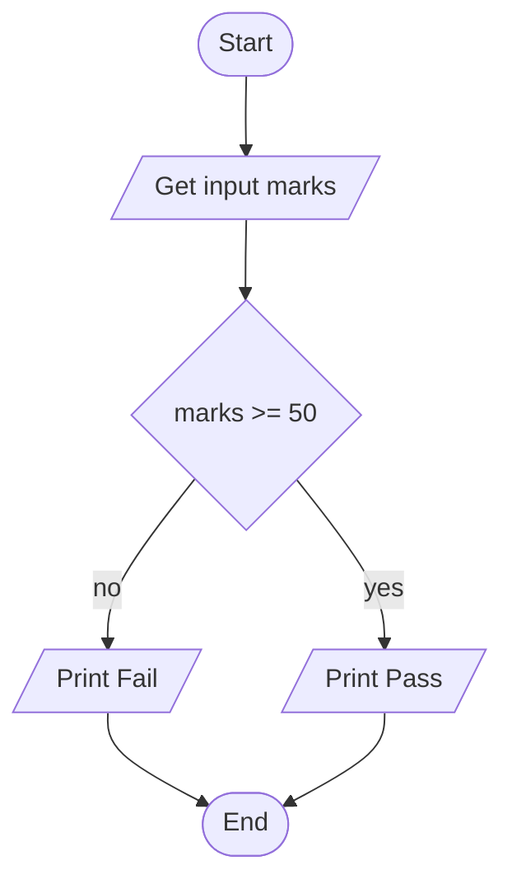

## 9 Calculate Factorial of a Number

### Pseudocode

```text
START
    INPUT N
    product = 1
    FOR i IN RANGE(1, N)
        product = product * i
    ENDFOR
    OUTPUT product
END
```


### Flowchart

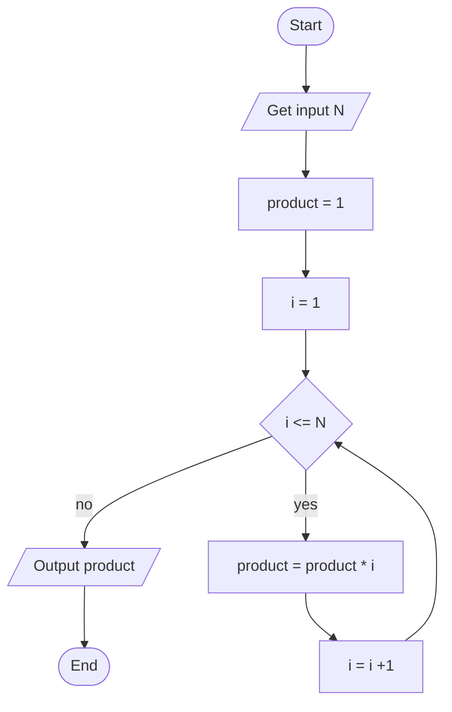

## 10 Calculate Discount on Purchase

### Pseudocode

```text
START
    INPUT price
    IF price > 1000 THEN
        price = price * 0.9
    ENDIF
    OUTPUT price
END
```
Note: The assignment says greater than, not greater or equal

### Flowchart

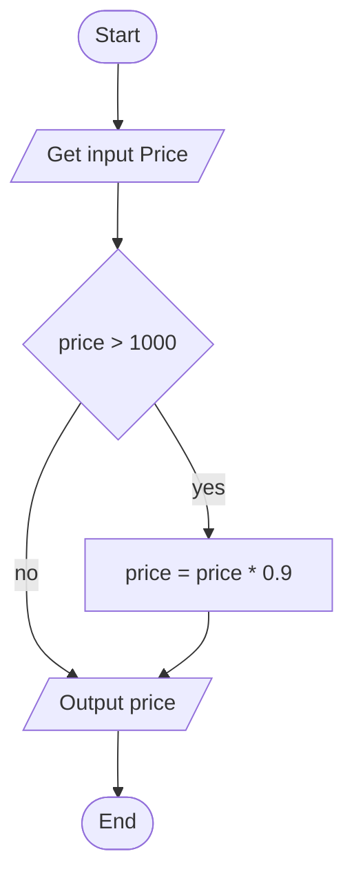

## 11 Online Shopping Delivry Eligibility

### Pseudocode

```text
START
    INPUT price
    IF price >= 500 THEN
        PRINT "Free Delivery"
    ELSE
        PRINT "Delivery Charges Applies"
    ENDIF
END
```

### Flowchart

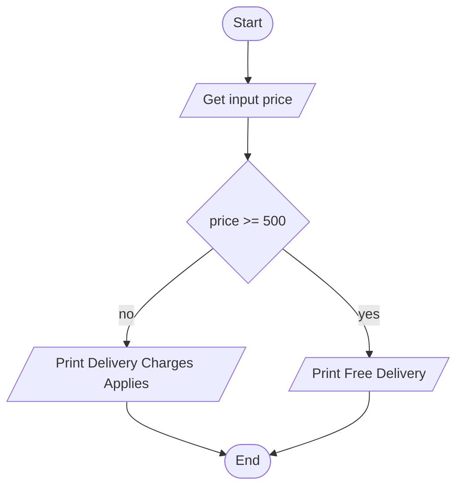

## 12 Employee Salary and Bonus Calculator

### Pseudocode

```text
START
    INPUT salary
    INPUT years
    bonus = 0
    IF years >= 5 THEN
        bonus = 10
    ELSE
        bounus = 5
    ENDIF
    totalSalary = (salary * (100 + bonus))/100
    PRINT "Your bonus is " + bonus + "%"
    PRINT "Your total salary is " + totalSalary
END
```
The else part could be considered redundant here since you could just initate bonus to 5, but I think in this case it is clearer this way. 

### Flowchart

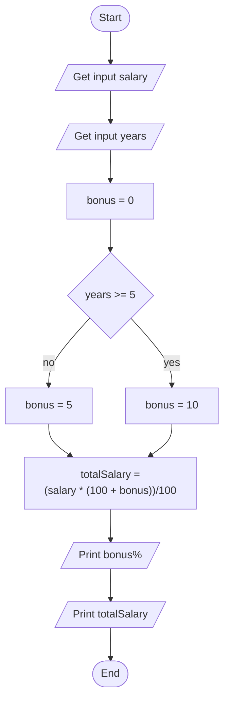

## 13 Mobile Data Usage Monitor

### Pseudocode

```text
START
    INPUT dataLimit
    INPUT dataUsage
    IF dataUsage <= dataLimit THEN
        remaining = dataLimit - dataUsage
        Print "Data remaining " + remaining
    ELSE
        PRINT "Data limit exceeded"
    ENDIF
END
```

### Flowchart

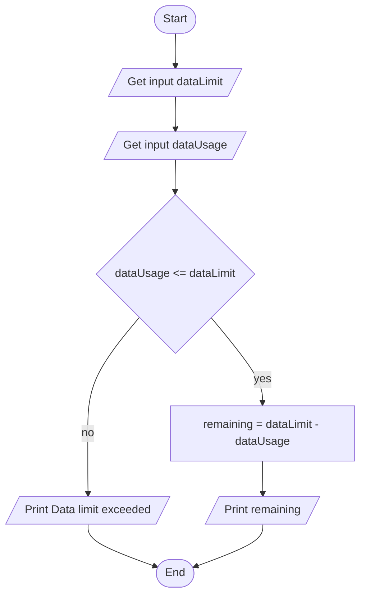

## 14 Login System (Maximum 3 Attempts)

### Pseudocode

```text
START
    correct = *****
    FOR attempt IN 3
        INPUT enteredPassword
        IF enteredPassword == correct THEN
            PRINT Access Granted
            RETURN
        ENDIF
        PRINT Try Again
    ENDFOR
    PRINT Account Locked
END
```

Some notes on this one:
Presumable the correct password would be entered as an input from the program or retrieved from a database rather than hardcoded as it is here. 
Here I used the keyword RETURN wich should let us instantly exit this block of code. If this is not available (I don't think we have talked about it) it is possible to achieve the same thing without it but the code becomes a bit more complicated. 

### Flowchart

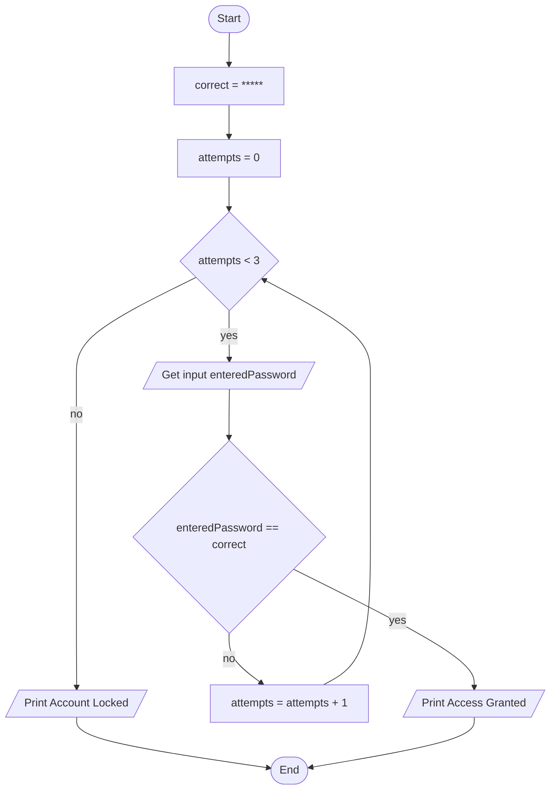

## 15 Store Checkout with Multiple Items

### Pseudocode

```text

```

### Flowchart

```mermaid
flowchart TD

```

## 16 Electricity Bill Calculator

### Pseudocode

```text

```

### Flowchart

```mermaid
flowchart TD

```