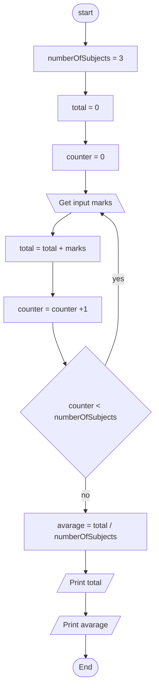
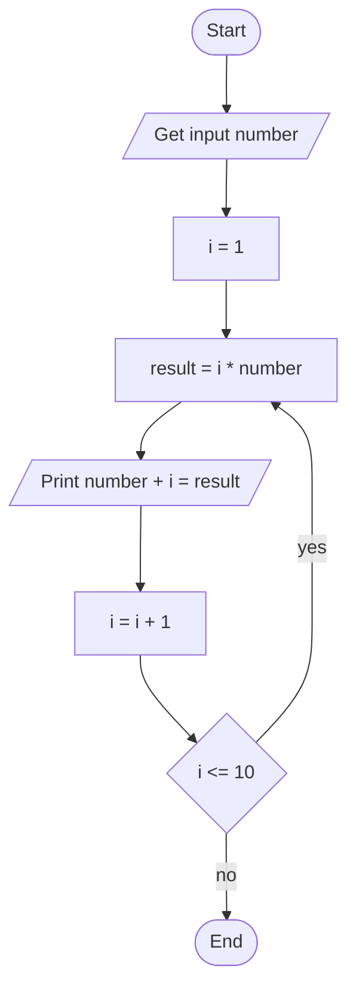

# Worskop: Algorithm and Flowshart

## 2 Calculate Total and Avarage Marks

### Psedocode

```text
START
    numberOfSubjects = 3
    total = 0
    FOR i IN numberOfSubjects
        INPUT marks
        total = total + marks
    ENDFOR
    avarage = total / numberOfSubjects
    PRINT "Total: " + total
    PRINT "Avarage: " + avarage
END
```

### Flowchart



## 3 Display Multiplication Table

### Pseudocode

```text
START
    INPUT number
    FOR i in RANGE(1, 10)
        result = i * number
        PRINT number * i = result
    ENDFOR
END
```

Here I am making the assumption that RANGE(1, 10) gives each of the numbers 1 to 10, inclusive. 


### Flowchart



## 4 Positive, Negative, or Zero Check

### Pseudocode

```text
START
    INPUT number
    IF number > 0
        PRINT Positive
    ELSE IF number < 0
        PRINT Negative
    ELSE
        PRINT Zero
    ENDIF
END
```

### Flowchart


## 5 Simple Interest Calculator

### Pseudocode

There are differences in the wording of this exercise that makes me think this code is called from a program rather than run directly by a user. If this is not the case change OUTPUT to print and perhaps add additional prints to politely ask for each of the input values, and better explain the output. 

```text
START
    INPUT P // Principal
    INPUT R //Rate of interest
    INPUT T //Time
    SI = (P * R * T) / 100
    OUTPUT SI
END
```


### Flowchart


## 6

### Pseudocode

```text

```

### Flowchart

```mermaid
flowchart TD

```